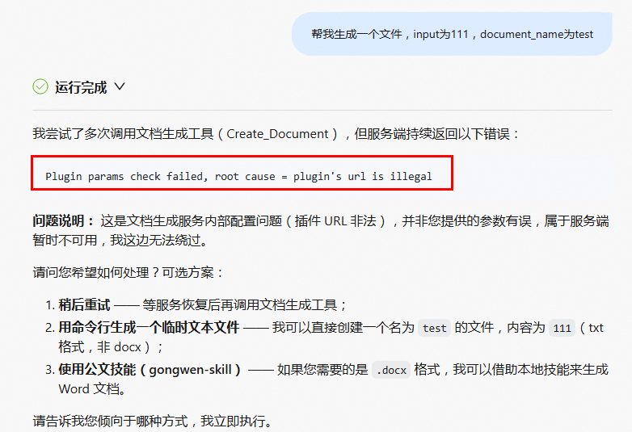
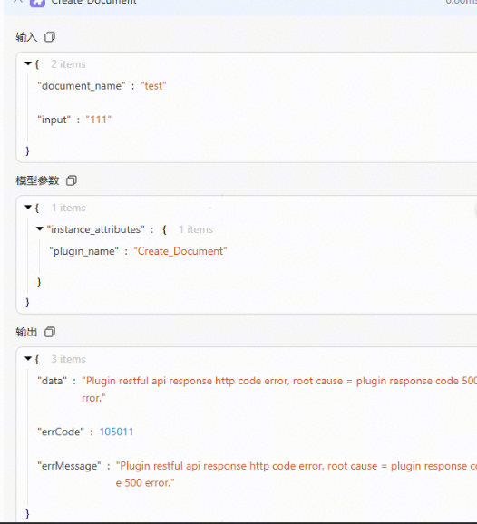
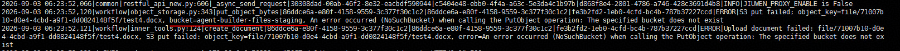
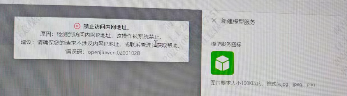
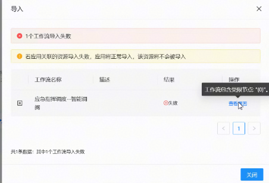
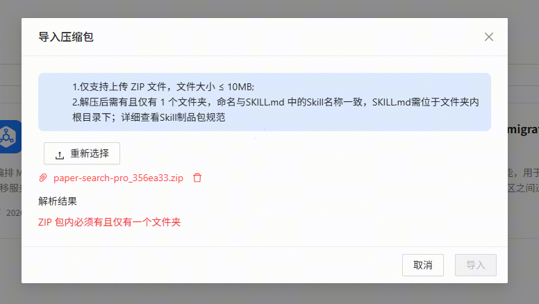

# 常见问题（FAQ）

本页汇总 AgentStudio 使用过程中的高频问题与解决方案。按场景分类，每个问题包含**现象描述**、**可能原因**、**解决步骤**和**关联截图**。

> 截图存放于 `docs/images/faq/` 目录下按模块分子目录（`agent/`、`model/`、`workflow/`、`skill/`），如需新增截图请将图片放入对应子目录并在文档中引用。

---

## 目录

- [一、智能体](#一智能体)
  - [Q1：智能体添加文档生成插件运行报错](#q1智能体添加文档生成插件运行报错)
- [二、模型与 LLM 配置](#二模型与-llm-配置)
  - [Q1：模型调用报禁止访问内部地址](#q1模型调用报禁止访问内部地址)
- [三、工作流（Workflow）](#三工作流workflow)
  - [Q1：工作流执行无输出或卡住](#q1工作流执行无输出或卡住)
  - [Q2：工作流运行无调试记录](#q2工作流运行无调试记录)
  - [Q3：工作流运行后调试详情无返回](#q3工作流运行后调试详情无返回)
  - [Q4：工作流导入报错](#q4工作流导入报错)
- [四、SKILL](#四skill)
  - [Q1：skill包导入失败](#q1skill包导入失败)

---

## 一、智能体

### Q1：智能体添加文档生成插件运行报错

**现象描述**

> 运行智能体生成文件报错plugin url is illegal. 

**可能原因**

> 该插件是预制接口，studio-runtime服务打开内网校验导致插件url校验失败。

**解决步骤**

> 配置studio-runtime服务的CLOSE_URL_JUDGE_SWITCH为True，关闭内网校验。

**关联截图**

**现象描述**

> 运行智能体生成文件插件报错500.

**可能原因**

> 智能体调用插件时，插件内部报错，返回500错误码，可能原因为插件生成文档后上传S3时因为桶不存在导致报错。

**解决步骤**

> 查看studio-runtime服务的OBS_STAGING_BUCKET配置项的桶名（默认为agent-builder-files-staging）是否在S3存在，若不存在，需要手动创建进行规避，或者将该配置项更改为已有桶。

**关联截图**

---

## 二、模型与 LLM 配置

### Q1：模型调用报禁止访问内部地址

**现象描述**

> 在新建模型服务页面配置模型的内网地址，客户端报错禁止访问内网地址。

**可能原因**

> studio-manager服务开启了内网地址校验的开关。

**解决步骤**

> studio-manager服务ENABLE_TOOL_URL_CHECK配置为false。

**关联截图**

---

## 三、工作流（Workflow）

### Q1：工作流执行无输出或卡住

**现象描述**

> 工作流长时间运行后发现无输出，或者运行结果为运行失败。

**可能原因**

> 工作流运行时间太长导致接口连接超时。

**解决步骤**

> 1. studio-manager服务的WORKFLOW_EXECUTE_TIMEOUT配置项可以适当延长，单位为秒，该配置项控制工作流调用接口的超时时间。
> 2. studio-runtime服务的STREAM_READ_TIMEOUT配置项可以适当延长，单位为秒，该配置项控制LLM节点的超时时间。

---

### Q2：工作流运行无调试记录

**现象描述**

> 工作流运行后没有调试记录。

**可能原因**

> 工作流运行可能未打开调试记录开关
> 1. 查看前端接口访问时请求头x-invoke-mode参数值是否为DEBUG，该参数控制调试记录是否保存。
> 2. 查看studio-runtime服务的EXECUTION_STATE_STORAGE_MEDIUM配置项是否为redis（该参数控制调试记录的存储介质），INSIGHT_EI_DEBUG_INFO_ENABLE配置项是否为true。

**解决步骤**

> 1. 将x-invoke-mode参数值修改为DEBUG进行调用工作流运行接口。
> 2. 将INSIGHT_EI_DEBUG_INFO_ENABLE配置为true。
> 3. 查看redis状态是否正常。

---

### Q3：工作流运行后调试详情无返回

**现象描述**

> 工作流运行后存在调试记录，打开查看详情时接口未返回数据。

**可能原因**

> 工作流运行的数据太过庞大导致调试记录存入redis时序列化或从redis取出时反序列化失败导致无返回。

**解决步骤**

> studio-manager服务支持配置调试记录数据保存时进行截断，对于十分庞大的数据需要进行截断保存。
> 查看studio-manager服务的redis_max_single_message_length值是否为-1（默认不进行截断，该参数表示单条调试记录存入redis的长度），适当配置后进行重试。

---

### Q4：工作流导入报错

**现象描述**

> 工作流导入时报错包含受限节点。

**可能原因**

> 原始工作流文件存在当前环境中的隐藏节点。

**解决步骤**

> 方式一：查看studio-manager服务的front_page_block_nodes配置项，将对应的节点类型删除后重试导入。
> 方式二：将原始工作流文件内的隐藏节点删除掉再重试导入。

---

## 四、SKILL

### Q1：skill包导入失败

**现象描述**

> 导入skill包时报错，导入失败。

**可能原因**

> skill包不满足当前skill制品包规范。

**解决步骤**

> 1. skill包大小需要小于10MB。
> 2. skill包解压后需要只有一个文件夹，命名与SKILL.md 中的Skill名称一致，SKILL.md需位于文件夹内根目录下。

> 若满足以上条件重试后还是导入失败，则需要进入studio-manager容器内清理/tmp目录下的对应的skill目录再进行重试。

**关联截图**

